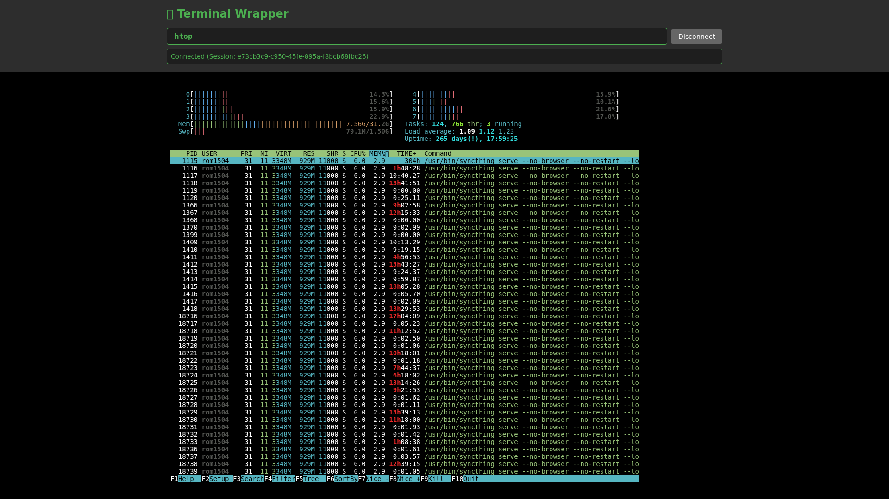

# Term Wrapper

[](https://github.com/rom1504/term-wrapper/actions/workflows/ci.yml)

A full-featured terminal emulator with web backend that can run any TUI (Text User Interface) application and control it via HTTP/WebSocket APIs.

## Features

- **PTY-based Terminal Emulation**: Full pseudo-terminal support for running terminal applications
- **FastAPI Backend**: RESTful API and WebSocket endpoints for terminal control
- **Session Management**: Create, manage, and control multiple terminal sessions
- **CLI Subcommands**: Scriptable terminal control from bash/shell without writing Python
- **Python Client Library**: High-level primitives (wait_for_text, wait_for_quiet, get_text)
- **Comprehensive Tests**: 118 tests covering unit, integration, and e2e scenarios

## What's Supported

### ✅ Fully Working

- **Simple commands**: `ls`, `cat`, `echo`, shell scripts
- **Interactive programs**: Python REPL, bash, interactive shells
- **Text editors**: `vim` (fully tested with comprehensive test suite)
- **System monitors**: `htop` (fully tested with screen buffer parsing)
- **AI CLI tools**: `claude` CLI (tested with both print and interactive modes)
- **Full-screen TUI apps**: Complete support for any terminal application
- **ANSI colors & formatting**: Complete support for escape sequences
- **Terminal resize**: Dynamic window resizing with SIGWINCH
- **Multiple sessions**: Concurrent terminal sessions with session management

### 🌐 Optional Web Frontend

The included web frontend (`frontend/`) serves as a **universal web mirror** for any TUI application:
- Access any terminal app through your browser with full rendering
- Built with [xterm.js](https://xtermjs.org/) for complete ANSI escape sequence support
- Mobile-friendly interface for running TUI apps on phones/tablets
- Not required - the REST/CLI API works standalone for programmatic control

<p align="center">
  
  <br>
  <em>Example: htop running in the web terminal UI</em>
</p>

## Architecture

```
┌─────────────────┐
│   CLI Client    │ ← Python client for interactive control
└────────┬────────┘
         │ HTTP/WebSocket
         ↓
┌─────────────────┐
│  FastAPI Server │ ← Web backend with REST + WebSocket
└────────┬────────┘
         │
         ↓
┌─────────────────┐
│ Session Manager │ ← Manages multiple terminal sessions
└────────┬────────┘
         │
         ↓
┌─────────────────┐
│ PTY Terminal    │ ← Pseudo-terminal for running TUI apps
└────────┬────────┘
         │
         ↓
┌─────────────────┐
│   TUI App       │ ← Any terminal application (vim, htop, etc.)
└─────────────────┘
```

## Installation

### From PyPI (Recommended for Users)

```bash
pip install term-wrapper
```

This installs the `term-wrapper` command:

```bash
term-wrapper --help
term-wrapper create htop
```

**The server starts automatically!** When you run a `term-wrapper` command, it automatically starts the backend server if it's not already running. The server picks an available port and saves it to `~/.term-wrapper/port` for future commands.

### From Source (For Development)

```bash
git clone https://github.com/rom1504/term-wrapper.git
cd term-wrapper
uv sync
```

When developing with uv, prefix commands with `uv run`:

```bash
uv run term-wrapper --help
uv run term-wrapper create htop
```

## Quick Start

### Run a TUI App

The server starts automatically when you use the CLI!

#### Option A: Using CLI Subcommands (Recommended)

```bash
# Create a session
SESSION=$(term-wrapper create bash -c "cd /tmp && claude" | python3 -c "import sys, json; print(json.load(sys.stdin)['session_id'])")

# Wait for text to appear
term-wrapper wait-text $SESSION "Welcome" --timeout 10

# Send input (supports \n, \r, \t, \x1b escape sequences)
term-wrapper send $SESSION "create hello.py\r"

# Get clean text output (ANSI codes stripped)
term-wrapper get-text $SESSION

# Wait for output to stabilize
term-wrapper wait-quiet $SESSION --duration 2

# Delete session
term-wrapper delete $SESSION
```

See all available subcommands:
```bash
term-wrapper --help
```

**Note**: In development with uv, prefix commands with `uv run`, e.g., `uv run term-wrapper --help
```

#### Option B: Using Python Client Library

```python
from term_wrapper.cli import TerminalClient

client = TerminalClient()
session_id = client.create_session(command=["bash"], rows=40, cols=120)

# High-level primitives
client.wait_for_text(session_id, "Welcome", timeout=10)
client.write_input(session_id, "ls -la\r")
text = client.get_text(session_id)  # Clean text, ANSI stripped
client.wait_for_quiet(session_id, duration=2)  # Wait for stability

client.delete_session(session_id)
client.close()
```

#### Option C: Using HTTP API Directly

```bash
# Create a session
curl -X POST http://localhost:8000/sessions \
  -H "Content-Type: application/json" \
  -d '{"command": ["python3", "examples/simple_tui.py"], "rows": 24, "cols": 80}'

# Returns: {"session_id": "xxx-xxx-xxx"}

# Get output
curl http://localhost:8000/sessions/{session_id}/output

# Send input
curl -X POST http://localhost:8000/sessions/{session_id}/input \
  -H "Content-Type: application/json" \
  -d '{"data": "+"}'

# Delete session
curl -X DELETE http://localhost:8000/sessions/{session_id}
```

## CLI Subcommands

The `term-wrapper` CLI command is installed automatically when you install the package via pip. It provides scriptable terminal control without writing Python code. All commands output JSON for easy parsing.

**Installation**: The CLI entry point is defined in `pyproject.toml` as:
```toml
[project.scripts]
term-wrapper = "term_wrapper.cli:sync_main"
```

After `pip install term-wrapper`, the `term-wrapper` command will be available in your PATH. During development with uv, use `uv run term-wrapper`.

### Available Subcommands

```bash
# Session Management
term-wrapper create [--rows N] [--cols N] [--env JSON] COMMAND...
term-wrapper list
term-wrapper info SESSION_ID
term-wrapper delete SESSION_ID

# Input/Output
term-wrapper send SESSION_ID TEXT           # Supports \n, \r, \t, \x1b
term-wrapper get-output SESSION_ID          # Raw output with ANSI codes
term-wrapper get-text SESSION_ID            # Clean text (ANSI stripped)
term-wrapper get-screen SESSION_ID          # Parsed 2D screen buffer

# Waiting Primitives
term-wrapper wait-text SESSION_ID TEXT [--timeout SECS]
term-wrapper wait-quiet SESSION_ID [--duration SECS] [--timeout SECS]

# Interactive
term-wrapper attach SESSION_ID              # WebSocket interactive mode
term-wrapper web SESSION_ID                 # Open session in browser

# Server Management
term-wrapper stop                           # Stop the background server
```

### Quick Example: Open Session in Browser

```bash
# Create a session
SESSION=$(term-wrapper create htop | python3 -c "import sys, json; print(json.load(sys.stdin)['session_id'])")

# Open it in your browser - that's it!
term-wrapper web $SESSION
```

### Shell Script Example

```bash
#!/bin/bash
# Automate vim file editing

SESSION=$(term-wrapper create vim myfile.txt | \
          python3 -c "import sys, json; print(json.load(sys.stdin)['session_id'])")

# Enter insert mode
term-wrapper send $SESSION "i"
sleep 0.3

# Type content
term-wrapper send $SESSION "Hello World\nLine 2"
sleep 0.5

# Save and quit (ESC + :wq)
term-wrapper send $SESSION "\x1b"
term-wrapper send $SESSION ":wq\r"
sleep 0.5

# Cleanup
term-wrapper delete $SESSION
```

See `examples/` directory for more examples with vim, htop, and Claude Code.

## Python Client Library

The `TerminalClient` class provides high-level primitives for terminal control:

```python
from term_wrapper.cli import TerminalClient

client = TerminalClient(base_url="http://localhost:8000")

# Session management
session_id = client.create_session(command=["bash"], rows=40, cols=120)
sessions = client.list_sessions()
info = client.get_session_info(session_id)
client.delete_session(session_id)

# Input/Output
client.write_input(session_id, "ls -la\r")
output = client.get_output(session_id, clear=True)
text = client.get_text(session_id, strip_ansi_codes=True)
screen = client.get_screen(session_id)  # 2D screen buffer

# Waiting primitives
client.wait_for_text(session_id, "username:", timeout=10)
client.wait_for_condition(session_id, lambda text: "done" in text, timeout=30)
client.wait_for_quiet(session_id, duration=2.0, timeout=30)

# Incremental reading
new_lines = client.get_new_lines(session_id)
client.mark_read(session_id)

client.close()
```

## API Reference

### REST Endpoints

- `POST /sessions` - Create a new terminal session
- `GET /sessions` - List all active sessions
- `GET /sessions/{id}` - Get session information
- `DELETE /sessions/{id}` - Delete a session
- `POST /sessions/{id}/input` - Send input to terminal
- `POST /sessions/{id}/resize` - Resize terminal window
- `GET /sessions/{id}/output` - Get raw terminal output
- `GET /sessions/{id}/screen` - Get parsed 2D screen buffer (clean text)

### WebSocket Endpoint

- `WS /sessions/{id}/ws` - Real-time bidirectional terminal I/O

## Testing

Run all tests:

```bash
uv run pytest tests/ -v
```

Run specific test suites:

```bash
# Unit tests
uv run pytest tests/test_terminal.py tests/test_api.py -v

# End-to-end tests
uv run pytest tests/test_e2e.py -v

# Integration tests with TUI apps
uv run pytest tests/test_ink_integration.py -v

# Vim tests
uv run pytest tests/test_vim.py -v
```

## Application Reports

We've tested various TUI applications with detailed reports:

| Application | Status | Report | Tests |
|-------------|--------|--------|-------|
| vim | ✅ Fully Functional | [reports/vim_report.md](reports/vim_report.md) | [tests/test_vim.py](tests/test_vim.py) |
| htop | ✅ Fully Functional | [reports/htop_report.md](reports/htop_report.md) | [tests/test_htop.py](tests/test_htop.py) |
| Claude CLI | ✅ Fully Functional | [reports/claude_report.md](reports/claude_report.md) | [tests/test_claude.py](tests/test_claude.py) |

Each report includes:
- Test methodology and results
- Usage examples (HTTP & WebSocket)
- Technical details (escape sequences, commands)
- Performance metrics
- Best practices

**Want to add a new application?** See [reports/TESTING_GUIDE.md](reports/TESTING_GUIDE.md) for a comprehensive step-by-step guide on testing and documenting new TUI applications.

## Claude Code Skill

Want to use term-wrapper with Claude Code? Check out the Term Wrapper skill!

The skill enables Claude to control any terminal application programmatically. See [skill/SKILL.md](skill/SKILL.md) for complete instructions on using term-wrapper with CLI commands, Python, or HTTP APIs.

## Web Frontend

Access any terminal application through your browser with the included web frontend.

### Quick Start

The server starts automatically when you use the CLI. To access the web frontend:

```bash
# Option 1: Use any term-wrapper command (auto-starts server)
term-wrapper create bash

# Find the port (saved in ~/.term-wrapper/port)
PORT=$(cat ~/.term-wrapper/port)

# Open in browser
http://localhost:$PORT/
```

Or start the server manually for development:

```bash
# Start server on fixed port
uv run python main.py

# Open in browser
http://localhost:8000/
```

### Launch Any Application

Use URL parameters to launch specific apps:

```bash
# Launch htop
http://localhost:8000/?cmd=htop

# Launch vim with a file
http://localhost:8000/?cmd=vim&args=/tmp/myfile.txt

# Launch Python REPL
http://localhost:8000/?cmd=python3
```

### One-Command Launch

Shell function to start server and open browser automatically:

```bash
# Add to ~/.bashrc or ~/.zshrc
tweb() {
    local cmd="${1:-bash}"
    if ! curl -s http://localhost:8000/health > /dev/null 2>&1; then
        cd /path/to/term_wrapper && uv run python main.py > /tmp/term-wrapper.log 2>&1 &
        sleep 2
    fi
    open "http://localhost:8000/?cmd=${cmd}"  # or xdg-open on Linux
}

# Usage
tweb htop                # Launch htop in browser
tweb vim /tmp/test.txt   # Launch vim in browser
```

**Full documentation:** See [frontend/README.md](frontend/README.md) for complete guide including mobile support, customization, and troubleshooting.

## Example TUI Apps

### Interactive htop Demo (`examples/htop_demo.py`)

Demonstrates full interaction with htop system monitor:
```bash
uv run python examples/htop_demo.py
```

Features:
- Navigate process list with arrow keys
- Toggle tree view
- Change sort order
- Interactive command mode
- Live system monitoring through the API

### Python TUI App (`examples/simple_tui.py`)

A simple counter application demonstrating:
- Terminal control codes
- Raw mode input handling
- Interactive key bindings

Controls:
- `+` : Increment counter
- `-` : Decrement counter
- `r` : Reset counter
- `q` : Quit

## Project Structure

```
term_wrapper/
├── term_wrapper/      # Main package
│   ├── terminal.py        # PTY-based terminal emulator
│   ├── session_manager.py # Session management
│   ├── api.py            # FastAPI backend
│   └── cli.py            # CLI client
├── tests/                 # Test suite
│   ├── test_terminal.py   # Terminal emulator tests
│   ├── test_api.py        # API tests
│   ├── test_e2e.py       # End-to-end tests
│   └── test_ink_integration.py # TUI app tests
├── examples/             # Example applications
│   ├── simple_example.py # Simple HTTP API usage
│   ├── vim_example.py    # Vim automation example
│   ├── htop_demo.py      # Interactive htop demonstration
│   └── simple_tui.py     # Python TUI demo
├── skill/                # Claude Code skill
│   └── SKILL.md          # Term Wrapper skill for AI agents
├── frontend/             # Web frontend with xterm.js
│   ├── README.md         # Frontend documentation and usage guide
│   ├── index.html        # Main web interface
│   ├── app.js           # Frontend application logic
│   └── style.css        # Styles and responsive design
├── docs/                 # Documentation
├── scripts/              # Utility scripts
├── main.py              # Server entry point
└── pyproject.toml       # Project configuration
```

## Development

Built with:
- **uv** - Fast Python package manager
- **FastAPI** - Modern web framework
- **uvicorn** - ASGI server
- **pytest** - Testing framework
- **websockets** - WebSocket support

### Release Process

Releases are automated through GitHub Actions when a commit message starts with "Release":

**Format:**
```
Release v0.5.2 - Brief description (optional)
```

The workflow will:
1. Extract the version (e.g., `v0.5.2`) from the commit message
2. Build the package with `uv build`
3. Publish to PyPI using stored credentials
4. Create a GitHub release with the same tag

**Steps to release:**
1. Update `version` in `pyproject.toml`
2. Update `CHANGELOG.md` with release notes
3. Commit changes with message starting with "Release":
   ```bash
   git commit -m "Release v0.5.2 - Description of changes"
   git push
   ```
4. The CI will automatically publish to PyPI and create a GitHub release

**Note:** The version in the commit message must match `pyproject.toml`.

## License

ISC
