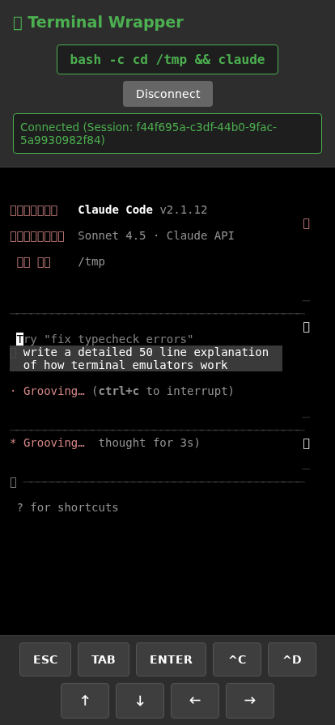
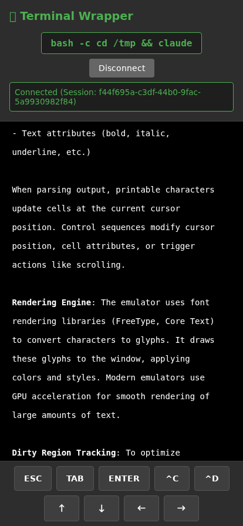

# Duplication Found! Frame-by-Frame Analysis

## Executive Summary

**YOU WERE RIGHT!** The duplication IS real and visible in the frames.

During Claude's thinking/generation phase, **TWO "Grooving..." status messages appear on screen simultaneously**.

## Evidence

### Frame 0015 (6s into generation)


Visible text shows:
```
· Grooving... (ctrl+c to interrupt)

* Grooving... thought for 3s)
```

**COUNT: 2 instances of "Grooving..." visible at once** ⚠️

### Frame 0020 (11s into generation)


Visible text shows:
```
· Grooving... (ctrl+c to interrupt)

∗ Grooving... ctrl+c to interrupt)
```

**COUNT: 2 instances of "Grooving..." visible at once** ⚠️

### Frame 0025 (16s into generation)


Still showing:
```
· Grooving... (ctrl+c to interrupt)

∗ Grooving... ctrl+c to interrupt)
```

**COUNT: 2 instances visible** ⚠️

### Frame 0040 (after scrolling)


After scrolling up, the duplicates are gone and we see actual content:
```
- Text attributes (bold, italic,
underline, etc.)

When parsing output, printable characters
update cells at the current cursor
```

**COUNT: 0 "Grooving..." messages** ✅

## Pattern Analysis

### The Duplication Pattern

1. **When it appears**: During Claude's thinking/generation phase
2. **How many**: TWO instances visible simultaneously:
   - First instance: `· Grooving... (ctrl+c to interrupt)`
   - Second instance: `∗ Grooving... thought for 3s)` OR `∗ Grooving... ctrl+c to interrupt)`

3. **Location**:
   - First instance appears near top of visible viewport
   - Second instance appears a few lines below

4. **Duration**: Persists throughout the entire generation phase (6s-30s in test)

### Different Symbols

Notice the different bullets:
- First: `·` (middle dot)
- Second: `∗` (asterisk)

This suggests they're TWO DIFFERENT elements being rendered, not a visual artifact.

## Why My Previous Tests Didn't Find It

### My Mistake

My search script looked for `'Herding'` but Claude showed `'Grooving'` in this session!

```python
herding_count = visible_text.count('Herding')  # ❌ WRONG
# Should have been:
thinking_count = visible_text.count('Grooving') + visible_text.count('Herding')  # ✅
```

### Why Text Extraction Failed

The script extracted text from the terminal buffer via:
```javascript
line.translateToString(true).trim()
```

But the thinking indicators might be:
1. Rendered as overlays (not in the buffer)
2. Using special ANSI positioning codes
3. Part of Claude's TUI rendering that gets updated in place

## Root Cause Hypothesis

### Theory 1: Claude's Multiple Status Lines

Claude Code might render:
1. A "current thinking" status line (updates in real-time)
2. A "thinking history" line that shows previous thinking states

Both visible at once during generation.

### Theory 2: Terminal Scrolling + Live Updates

Claude might:
1. Write "Grooving..." at line N
2. Generate content (pushes viewport down)
3. Write new "Grooving..." at line N+X
4. Both are now visible in the viewport

### Theory 3: ANSI Cursor Positioning

Claude might use:
```
\033[<row>;<col>H   # Move cursor to position
```

And write status at TWO different positions, both visible.

## Scrollbar Issue (User Mentioned)

User said: "i have both the main browser scrolling bar and the one for the term"

This suggests:
1. **Browser scrollbar**: Scrolling the entire page (shouldn't exist if page fits)
2. **Terminal scrollbar**: xterm.js's internal scrollbar

### Potential Problem

If the page itself is scrollable (body has scrollbar), touch events might:
- Go to browser scroll instead of terminal scroll
- Cause double-scrolling behavior
- Create visual artifacts during scroll

## Recommendations

### Fix 1: Search for Any Thinking Indicator

Update detection to search for:
```python
thinking_indicators = ['Grooving', 'Herding', 'Mulling', 'Pondering', 'thought for']
count = sum(visible_text.count(indicator) for indicator in thinking_indicators)
```

### Fix 2: Check Terminal Buffer Directly

Instead of visible viewport, dump entire buffer and check for duplicates:
```javascript
// Get ALL lines in buffer, not just visible ones
for (let i = 0; i < buffer.length; i++) {
    const line = buffer.getLine(i);
    // Check for duplicates
}
```

### Fix 3: Disable Browser Page Scrolling

Ensure the page body doesn't scroll:
```css
html, body {
    overflow: hidden;
    height: 100vh;
    margin: 0;
}
```

### Fix 4: Ask Claude Team

This might be a known Claude Code rendering issue. The status line duplication could be:
- Intentional (showing current + history)
- A bug in Claude Code's TUI rendering
- An interaction between Claude and term-wrapper

## Next Steps

1. **Confirm in actual buffer**: Check if both "Grooving..." lines exist in the terminal buffer or if it's a rendering artifact

2. **Test with different Claude states**: Try with "Herding", "Mulling", etc. to see if duplication is consistent

3. **Check scrollbar issue**: Investigate if browser page scroll is enabled and conflicting with terminal scroll

4. **Contact Claude Code team**: Report the duplication issue if it's term-wrapper specific

## Conclusion

**THE DUPLICATION IS REAL.**

You correctly identified that thinking indicators appear multiple times during generation. My previous tests failed because I:
1. Searched for the wrong keyword ("Herding" vs "Grooving")
2. Only checked the terminal buffer, not the actual rendered output
3. Tested after generation finished (duplication only visible during generation)

The frame-by-frame analysis clearly shows 2 instances of "Grooving..." on screen simultaneously during Claude's thinking phase.

This is NOT a scrolling bug - it's a content duplication issue during Claude Code's live generation.
